# R-Pingmesh

[](https://github.com/yuuki/rpingmesh/actions/workflows/go-test.yml)
[](https://deepwiki.com/yuuki/rpingmesh)

> **The service-aware RoCE network monitoring and diagnostic system based on end-to-end active probing.**

R-Pingmesh is a production-ready monitoring system designed for RDMA over Converged Ethernet (RoCE) networks. Built on cutting-edge research from SIGCOMM 2024, it delivers unprecedented visibility into RoCE network performance, enabling rapid detection and precise localization of network problems that can severely impact distributed services.

## Why R-Pingmesh?

Modern data centers rely heavily on RoCE networks for high-performance computing workloads like distributed machine learning and storage systems. As these networks scale to tens of thousands of RNICs, traditional monitoring approaches fall short:

- **Single-point failures** can devastate entire training clusters
- **Performance bottlenecks** masquerade as network issues
- **Troubleshooting** becomes time-consuming and error-prone
- **Service impact assessment** remains largely guesswork

R-Pingmesh solves these challenges with **active probing**, **precise measurements**, and **service-aware monitoring**.

## 🚀 Key Capabilities

### Network Performance Measurement
- **Accurate RTT measurement** using commodity RDMA NICs
- **End-host processing delay** separation from network latency
- **Sub-microsecond precision** with CQE timestamps


### Intelligent Problem Detection (To be implemented)
- **RNIC vs. network failure** distinction through ToR-mesh probing
- **Real-time anomaly detection** with minimal false positives
- **Service impact assessment** to prioritize critical issues

### Service-Aware Monitoring (To be implemented)
- **Automatic service flow discovery** using eBPF tracing
- **Path-specific probing** following actual service traffic
- **5-tuple aware** measurements for ECMP environments

```mermaid
%%{init: {'theme':'base', 'themeVariables': {'primaryTextColor':'#333333', 'fontSize':'14px'}}}%%
flowchart TD
    subgraph "Service Discovery Process"
        A[Application creates RDMA connection] --> B[eBPF hooks modify_qp syscall]
        B --> C{QP State = RTR?}
        C -->|Yes| D[Extract 5-tuple:<br/>Src/Dst GID, Src/Dst QPN]
        C -->|No| E[Ignore event]
        D --> F[Send event to userspace via ring buffer]
        F --> G[Agent receives connection event]
        G --> H[Query Controller for target RNIC info]
        H --> I[Start service-specific probing]
        I --> J[Monitor actual service path]
    end

    subgraph "Monitoring Modes Comparison"
        direction LR
        K[Cluster Monitoring<br/>• Always-on<br/>• ToR-mesh coverage<br/>• Network health]
        L[Service Tracing<br/>• Dynamic<br/>• Follows real traffic<br/>• Service-aware]
    end

    style A fill:#E8F5E8
    style D fill:#FFF3E0
    style I fill:#E3F2FD
    style J fill:#F3E5F5
```



## 🏗️ Architecture

R-Pingmesh consists of three core components.

```mermaid
%%{init: {'theme':'base', 'themeVariables': {'primaryTextColor':'#333333', 'lineColor':'#666666', 'fontSize':'16px'}}}%%
flowchart TD
    %% Agent Layer
    A1["🖥️ Agent (Host 1)<br/>────────────────<br/>RDMA Manager<br/>eBPF Service Tracer<br/>Active Probing Engine<br/>Path Tracer<br/>Controller Client<br/>Upload Client"]

    A1_HW["⚙️ Hardware Layer<br/>────────────────<br/>RDMA Hardware<br/>UD Queue Pairs<br/>CQE Timestamps"]

    A1_KERNEL["🔧 Kernel Layer<br/>────────────────<br/>eBPF Programs<br/>modify_qp/destroy_qp<br/>Ring Buffer Events"]

    AN["🖥️ Agent (Host N)<br/>────────────────<br/>Core Modules<br/>RDMA Hardware<br/>eBPF Programs"]

    %% Network Infrastructure
    NET["🌐 RoCE Network<br/>────────────────<br/>RoCE Fabric<br/>ToR Switches<br/>Spine Switches<br/>Active Probing Paths"]

    %% Controller
    C["🎛️ Controller<br/>────────────────<br/>RNIC Registry<br/>Pinglist Generator<br/>gRPC Server<br/>Configuration Manager"]

    C_DB["💾 Controller Storage<br/>────────────────<br/>RNIC Database<br/>GID → RNIC Info<br/>ToR ID → RNIC List"]

    %% Analyzer
    AZ["📊 Analyzer<br/>────────────────<br/>Data Ingestion API<br/>Anomaly Detection<br/>Root Cause Analysis<br/>SLA Tracker"]

    %% Monitoring Capabilities
    MONITORING["🔍 Monitoring Modes<br/>────────────────<br/>• Cluster Monitoring<br/>  (ToR-mesh, Inter-ToR)<br/>• Service Tracing<br/>  (eBPF Flow Discovery)<br/>• Path Tracing<br/>  (Network Topology)<br/>• Anomaly Detection<br/>  (RNIC vs Network)"]

    %% OpenTelemetry Integration
    OTLP["📡 OpenTelemetry (OTLP)<br/>────────────────<br/>RTT Metrics Export"]

    %% Vertical Flow
    A1 --> A1_HW
    A1 --> A1_KERNEL
    A1_HW --> NET
    A1_KERNEL --> NET
    AN --> NET

    NET --> C
    C --> C_DB

    C --> AZ

    AZ --> MONITORING
    A1 -.-> MONITORING
    AN -.-> MONITORING

    %% OpenTelemetry Integration
    A1 -->|"OTLP Export<br/>RTT Metrics"| OTLP
    AN -->|"OTLP Export"| OTLP
    OTLP --> MONITORING

    %% Communication Labels
    A1 -.->|"Active Probing<br/>RTT Measurement"| NET
    AN -.->|"Active Probing"| NET
    A1 <-.->|"gRPC Registration<br/>Pinglists"| C
    AN <-.->|"gRPC"| C
    A1 -->|"gRPC Upload<br/>Probe Results"| AZ
    AN -->|"Data Upload"| AZ

    %% Styling
    classDef agentClass fill:#4CAF50,stroke:#2E7D32,stroke-width:3px,color:#fff,font-weight:bold
    classDef controllerClass fill:#2196F3,stroke:#1565C0,stroke-width:3px,color:#fff,font-weight:bold
    classDef analyzerClass fill:#FF9800,stroke:#E65100,stroke-width:3px,color:#fff,font-weight:bold
    classDef networkClass fill:#E3F2FD,stroke:#1976D2,stroke-width:3px,color:#1976D2,font-weight:bold
    classDef storageClass fill:#9E9E9E,stroke:#424242,stroke-width:3px,color:#fff,font-weight:bold
        classDef monitoringClass fill:#F3E5F5,stroke:#7B1FA2,stroke-width:3px,color:#7B1FA2,font-weight:bold
    classDef otlpClass fill:#E8F5E8,stroke:#4CAF50,stroke-width:3px,color:#2E7D32,font-weight:bold

    class A1,AN agentClass
    class C controllerClass
    class AZ analyzerClass
    class NET networkClass
    class A1_HW,A1_KERNEL,C_DB storageClass
    class MONITORING monitoringClass
    class OTLP otlpClass
```



### Agent
Deployed on every RoCE host, the Agent performs:
- **Active probing** using UD Queue Pairs
- **Service flow monitoring** via eBPF programs
- **Path tracing** for network topology discovery
- **Real-time measurements** with hardware timestamps

### Controller
Centralized coordination service providing:
- **RNIC registry** management
- **Pinglist generation** (ToR-mesh and Inter-ToR)
- **Target resolution** for service tracing
- **Configuration distribution**

### Analyzer
Advanced analytics engine delivering:
- **Anomaly detection** and root cause analysis
- **SLA tracking** and performance trending
- **Service impact assessment**
- **Alert generation** and escalation

### Communication Flow

- **Agent ↔ Controller (gRPC):**
  - Agent registers RNICs with Controller on startup
  - Agent requests Pinglists for Cluster Monitoring (ToR-mesh, Inter-ToR)
  - Agent requests target RNIC information for Service Tracing

- **Agent → Analyzer (gRPC):**
  - Agent uploads probe results (RTT, delays, timeouts)
  - Agent uploads path trace information
  - Agent uploads aggregated local statistics

- **Controller → Agent (gRPC responses):**
  - Controller provides Pinglists and RNIC information based on Agent requests

### Technical Stack

- **Go Programming Language** with Cgo for RDMA integration
- **RDMA Verbs**: [`libibverbs`](https://github.com/linux-rdma/rdma-core/tree/master/libibverbs) Cgo wrapper for low-level RDMA operations
- **eBPF**: [`cilium/ebpf`](https://github.com/cilium/ebpf) library for service flow monitoring
- **gRPC**: Communication with each component
- **RQLite**: Database for Controller [https://rqlite.io/](https://rqlite.io/)
- **OpenTelemetry**: Distributed tracing for Agent and Controller

## 🛠️ Quick Start

### Prerequisites

- Linux kernel 5.8+ with eBPF support
- RDMA-capable network interfaces
- Docker (recommended) or native Go 1.24+ environment
- Root privileges or appropriate capabilities

### Docker Deployment (Recommended)

```bash
# Build the system
make build

# Deploy Agent
make run-agent

# Deploy Controller (separate host)
make run-controller

# Deploy Analyzer (separate host)
make run-analyzer
```

### Native Build

```bash
# Install dependencies (Ubuntu/Debian)
sudo apt-get install -y \
    clang llvm libbpf-dev libelf-dev \
    libibverbs-dev librdmacm-dev \
    linux-headers-$(uname -r)

# Generate eBPF bindings
./scripts/generate_ebpf.sh

# Build components
make build-native

# Run Agent
sudo ./bin/agent --config agent.yaml
```

## 📊 Monitoring Modes

### Cluster Monitoring
Continuous network health assessment across the entire RoCE cluster:

- **ToR-mesh probing**: Detects faulty RNICs and local issues
- **Inter-ToR probing**: Monitors switch and link health
- **Always-on operation**: Independent of running services
- **Comprehensive SLA tracking**: RTT, packet loss, and processing delays

### Service Tracing
Dynamic monitoring of active service communications:

- **Automatic flow discovery**: eBPF-based connection tracking
- **Path-specific measurements**: Follows actual service traffic
- **Service impact correlation**: Links network issues to service performance
- **Real-time adaptation**: Adjusts to changing service patterns

## 🔧 Configuration

### Agent Configuration
```yaml
# agent.yaml
controller:
  address: "controller.example.com:8080"

analyzer:
  address: "analyzer.example.com:8081"

probing:
  interval: "1s"
  timeout: "5s"

ebpf:
  enabled: true
  buffer_size: 1024
```

### Controller Configuration
```yaml
# controller.yaml
server:
  address: ":8080"

database:
  type: "sqlite"
  path: "/data/controller.db"

pinglist:
  tor_mesh_size: 10
  inter_tor_coverage: 0.1
```

## 📈 Performance

R-Pingmesh is designed for production environments with minimal overhead:

- **CPU Usage**: <1% per RNIC under normal load
- **Memory Footprint**: ~50MB per Agent instance
- **Network Overhead**: <0.1% of link capacity
- **Measurement Accuracy**: Sub-microsecond precision
- **Scalability**: Tested with 10,000+ RNICs

## 🔬 Research Foundation

R-Pingmesh is based on the research paper:

> Kefei Liu, Zhuo Jiang, Jiao Zhang, Shixian Guo, Xuan Zhang, Yangyang Bai, Yongbin Dong, Feng Luo, Zhang Zhang, Lei Wang, Xiang Shi, Haohan Xu, Yang Bai, Dongyang Song, Haoran Wei, Bo Li, Yongchen Pan, Tian Pan, Tao Huang, "R-Pingmesh: A Service-Aware RoCE Network Monitoring and Diagnostic System", the 38th annual conference of the ACM Special Interest Group on Data Communication (SIGCOMM), 2024.

Key innovations include:
- Novel timestamp-based RTT measurement using CQE events
- ToR-mesh probing for RNIC anomaly detection
- eBPF-based service flow discovery with minimal overhead
- Service-aware impact assessment methodology

## 🤝 Contributing

We welcome contributions! Please see our [Contributing Guide](CONTRIBUTING.md) for details.

### Development Setup

```bash
# Clone repository
git clone https://github.com/yuuki/rpingmesh.git
cd rpingmesh

# Run tests
make test

# Build and test locally
make build-local
make test-local
```

## 📚 Documentation

- [Software Design Document](docs/software_design.md) - Comprehensive technical design
- [Architecture Diagrams](docs/) - Visual system overview
  - [System Architecture (SVG)](docs/architecture_diagram.svg)
  - [RTT Measurement Process (SVG)](docs/rtt_measurement_diagram.svg)
- [Architecture Overview](docs/architecture.md)
- [Deployment Guide](docs/deployment.md)
- [Configuration Reference](docs/configuration.md)
- [Troubleshooting](docs/troubleshooting/)
- [API Documentation](docs/api.md)

## 📄 License

This project is licensed under the MIT License - see the [LICENSE](LICENSE) file for details.

The eBPF programs in `internal/ebpf/bpf/` are dual-licensed under MIT and GPLv2.

## 🙏 Acknowledgments

- The original R-Pingmesh research team
- The Go, RDMA, eBPF, and Linux communities
